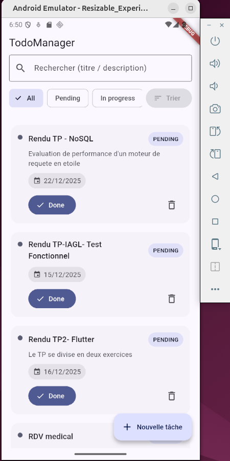
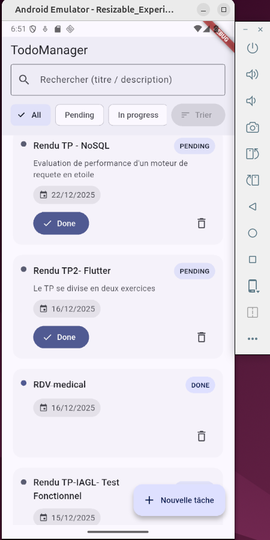
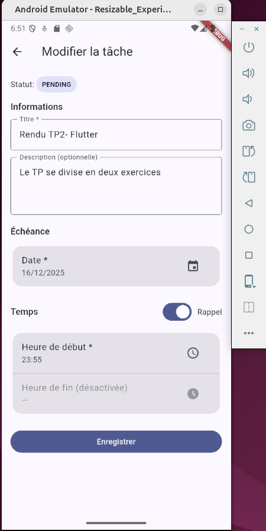
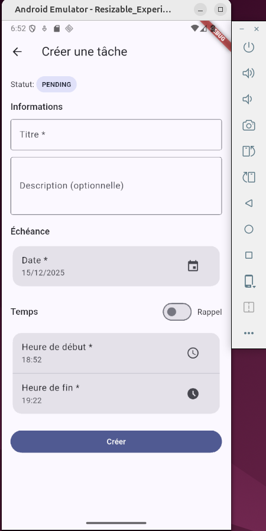
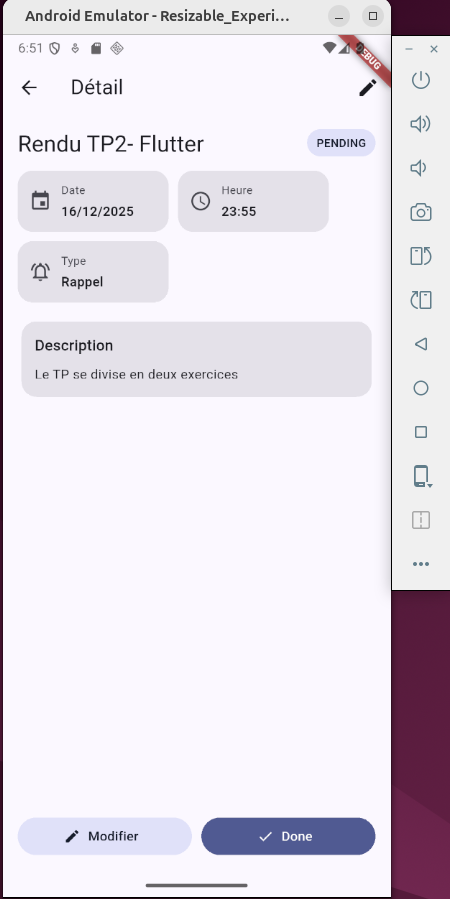

# 📝 TodoManager

TodoManager est une application Flutter de gestion de tâches **orientée production**, conçue avec une **Clean Architecture**, un **state management BLoC**, et une **logique métier strictement validée**.

L’application permet de créer, consulter, modifier, finaliser et supprimer des tâches, avec gestion avancée des **dates**, **heures**, et **rappels**.

---

## ✨ Fonctionnalités

- ➕ Création de tâches
- 📋 Liste des tâches avec :
  - recherche (titre / description)
  - filtres (All / Pending / In Progress / Done)
  - tri (date, titre, création)
- 🕒 Gestion des dates et heures (format 24h)
- 🔔 Mode **Rappel** (heure de fin optionnelle)
- ✏️ Modification d’une tâche
- ✅ Finalisation d’une tâche
- 🗑️ Suppression avec **Undo**
- 📱 UI moderne (Material 3, chips colorés, cards)
- 🧪 Couverture de tests unitaires (domain + BLoC)

---

## 🧠 Règles métier importantes

- Le **titre** est obligatoire et non vide
- La **date d’échéance** est obligatoire
- L’**heure de début** est obligatoire
- L’**heure de fin** est obligatoire **sauf si la tâche est un rappel**
- Le statut initial d’une tâche est toujours `PENDING`
- La modification d’une tâche ne change **jamais** son statut
- Une tâche finalisée passe à l’état `DONE`

---

## 📸 Captures d’écran

> Place tes images dans `docs/screenshots/`

```text
docs/
 └── screenshots/
     ├── task_list.png
     ├── task_detail.png
     ├── task_create.png
     ├── task_edit.png
```
---

## Demonstration


---

## 🏗️ Architecture
L’application suit une Clean Architecture orientée features :

```text
lib/
 ├── app/                # Injection de dépendances
 ├── core/               # Erreurs, validators, utils
 └── features/
     └── tasks/
         ├── domain/     # Entités, use cases, repository contracts
         ├── data/       # SQLite, models, repository impl
         └── presentation/
             ├── bloc/   # BLoC / events / states
             ├── pages/  # UI pages
             └── widgets/# Composants UI réutilisables
```

---

## 🗄️ Stockage

- Base de données locale SQLite
- Migration gérée (versioning)
- Table principale : tasks

--- 

## ▶️ Lancer le projet

Prérequis
    - Flutter SDK (stable)
    - Dart >= 3

---

## Installation

```bash
git clone https://github.com/ton-username/todomanager.git
cd todomanager
flutter pub get
flutter run
```

---

## 🧪 Tests

Les tests couvrent :

    - la logique métier (use cases)
    - les BLoC (create, edit, list, detail)

```bash
flutter test
```

---

## 🚀 Évolutions possibles

- Synchronisation cloud
- Notifications système pour les rappels
- Authentification utilisateur
- Thèmes personnalisables
- Export / import de tâches

## 👨‍💻 Auteur
Projet développé par Ahmedou Salem

